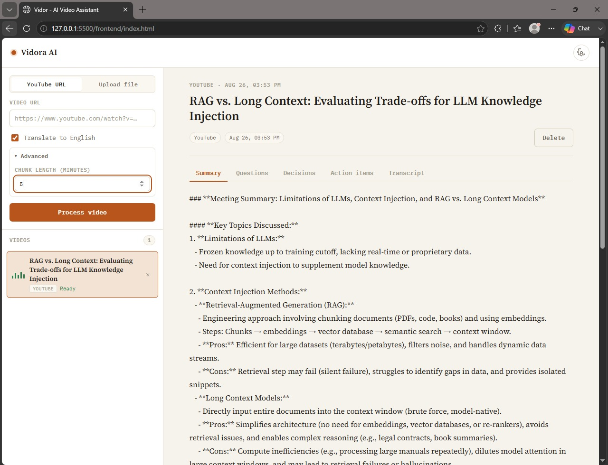
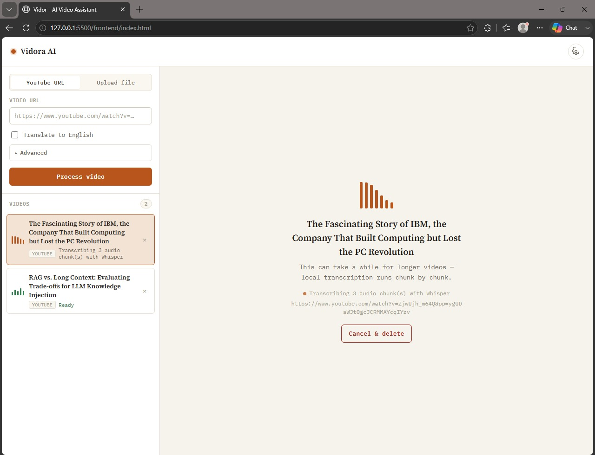
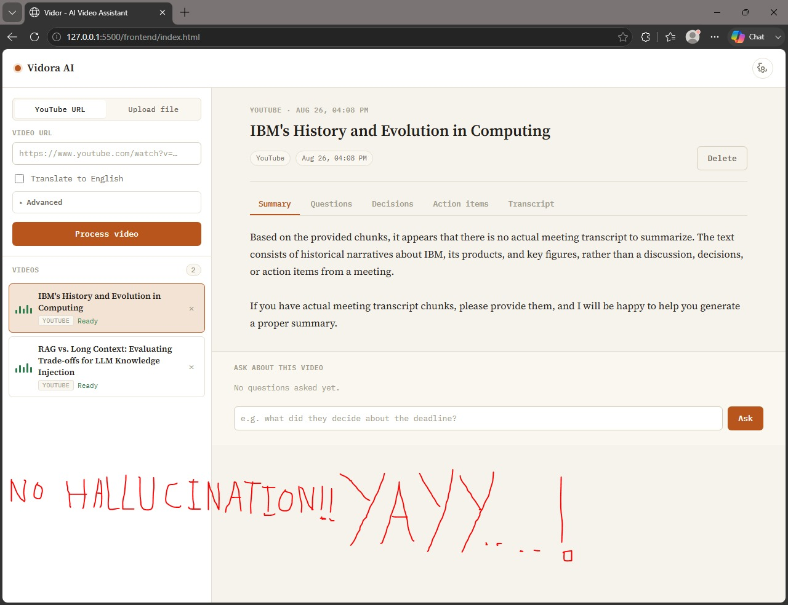
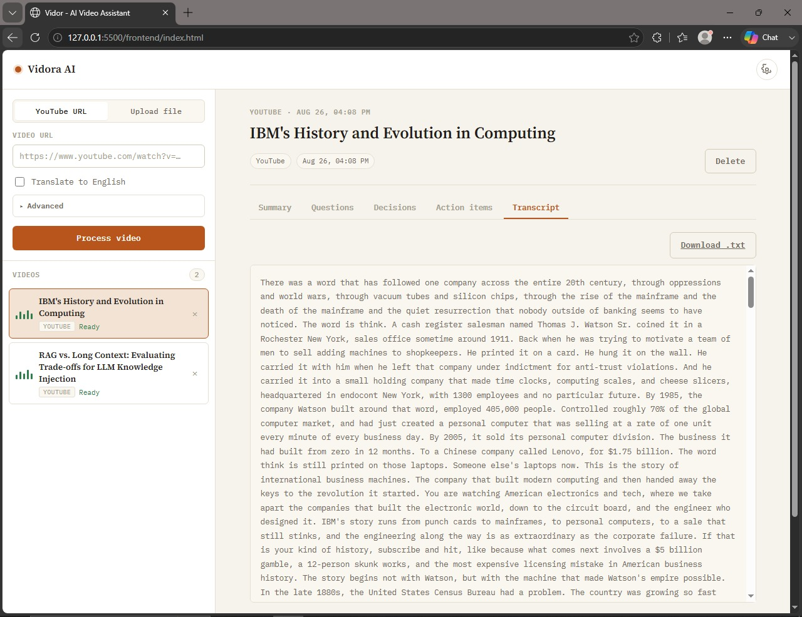
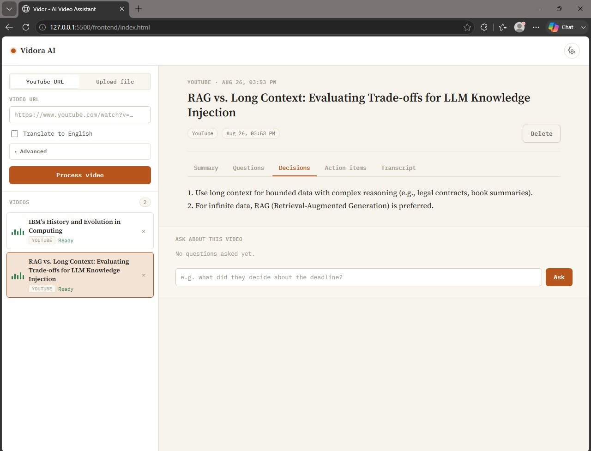

<div align="center">

# 🎬 Vidora AI

### A self-hosted, multi-agent pipeline that turns any video into a transcript, a structured brief, and a grounded conversation

*Point it at a URL. It downloads, transcribes, extracts, indexes — and then answers questions without making things up.*

[](https://www.python.org/)
[](https://fastapi.tiangolo.com/)
[](https://www.langchain.com/)
[](https://mistral.ai/)
[](https://github.com/openai/whisper)
[](https://www.trychroma.com/)
[](https://github.com/yt-dlp/yt-dlp)
[](https://developer.mozilla.org/en-US/docs/Web/JavaScript)
[](LICENSE)

</div>

---

## Overview

**Vidora AI** is a full-stack, self-hosted video-intelligence system. Give it a YouTube URL, or upload a local video/audio file, and it runs an autonomous ingestion pipeline that **downloads and normalizes the audio, transcribes it locally with Whisper, distills it into a structured brief (title, summary, decisions, action items, open questions) via an LLM chain, and builds a dedicated, isolated retrieval index for that video alone** , so you can ask it anything about that specific piece of content and get an answer grounded strictly in what was actually said, not in what a language model assumes was probably said.

Where a naive "wrapper" project pipes a transcript straight into a single prompt and calls it a day, Vidora is architected around **per-video isolation and defensive engineering at every seam**: every video gets its own working directory, its own Chroma collection, and its own background job, so processing five videos concurrently never lets one video's status, transcript, or vector index leak into another's. The retrieval-augmented answer chain is explicitly instructed to decline rather than fabricate when the indexed transcript doesn't contain the answer, and the system prompt never lets the model reveal that it's even doing retrieval, it just answers, as if it watched the video.

The backend is a fully modular **FastAPI** service, async ingestion endpoints, `BackgroundTasks`-driven concurrent processing, and a documented OpenAPI surface, fronted by a dependency-free **vanilla HTML/CSS/JS** single-page interface with a deliberate, audio-native visual identity. No React, no build step, no bundler: open a file, or point a static server at it.

---

## Table of Contents

- [Overview](#overview)
- [Features](#features)
- [Architecture](#architecture)
- [Design Philosophy](#design-philosophy)
- [Screenshots](#screenshots)
- [Tech Stack](#tech-stack)
- [Project Structure](#project-structure)
- [API Reference](#api-reference)
- [Getting Started](#getting-started)
- [Configuration](#configuration)
- [Notable Engineering Work](#notable-engineering-work)
- [Known Limitations](#known-limitations)
- [Roadmap Ideas](#roadmap-ideas)
- [Contributing](#contributing)
- [License](#license)

---

## Features

**Ingestion**
- **Dual ingestion paths** — a YouTube (or any yt-dlp-supported) URL via `POST /videos/url`, or a local video/audio file via `POST /videos/upload`, both funneled through the identical downstream pipeline.
- **True concurrency, not a queue of one** — every submission is assigned a UUID `video_id` and dispatched to FastAPI `BackgroundTasks` immediately; submitting (or resubmitting) several videos back-to-back processes them in parallel instead of serializing behind a single in-flight job.
- **Resilient against YouTube's bot-detection** — downloads are wrapped in exponential-backoff retry logic that specifically targets transient `403`/`429`/timeout responses, layered with multi-player-client fallback (`android`, `web`) extractor args and optional cookie-authenticated sessions for accounts that need them.

**Transcription**
- **Local, offline speech-to-text** via OpenAI's Whisper (`tiny` by default, swappable to any local checkpoint) — no third-party ASR API, no audio ever leaves the machine.
- **Duration-aware chunking** — long-form audio is segmented at a configurable interval before transcription; a trailing remainder shorter than the minimum viable segment is merged into the previous chunk rather than transcribed on its own, eliminating a real failure mode where Whisper's encoder throws on a near-zero-length tensor.
- **Thread-safe, lazily-loaded model singleton** — the Whisper checkpoint is loaded once per process behind a lock, not once per chunk or per request.

**Structured extraction**
- **Two-stage summarization** — each transcript is first summarized chunk-by-chunk to compress it under the LLM's effective context budget, then a second LangChain/Mistral chain extracts **title, executive summary, decisions, action items, and open questions** as discrete, independently addressable fields.
- **Template-injection-safe prompting** — transcript content is passed into chat prompts as bound template variables, never string-spliced into the prompt body, so a transcript containing literal `{}` characters (code, timestamps, JSON) can't corrupt the prompt or crash the chain.

**Retrieval-augmented chat**
- **One Chroma collection per video** — embeddings (via `sentence-transformers/all-MiniLM-L6-v2`) are persisted to `data/<video_id>/chroma_db`, keyed and namespaced by `video_id`, so no video's semantic index can ever surface in another video's answers.
- **Query-expansion retrieval** — `MultiQueryRetriever` generates multiple reformulations of a single question before searching, improving recall against a single dense embedding of the user's literal phrasing.
- **Grounded, non-hallucinating answer synthesis** — the answer chain is explicitly instructed to say it doesn't know rather than invent an answer when the retrieved context doesn't cover the question, and to never reveal the retrieval mechanism itself.

**Reliability**
- **Sanitized, structured failure states** — raw ANSI-coded, multi-hundred-line `ffmpeg`/`yt-dlp` failures are stripped and truncated to a short, storable, human-readable message before being persisted; the full traceback still reaches the server logs.
- **Idempotent retry without re-uploading** — `POST /videos/{id}/retry` re-runs a failed job against its *original* source (URL or already-stored file) under the same `video_id`, so a transient failure never costs you the upload.
- **Guaranteed cleanup, success or failure** — intermediate audio artifacts are always purged once a job terminates, so a failed run doesn't silently accumulate disk usage.
- **Explicit vector-store resource release on delete** — chromadb caches one open connection per persist directory for the life of the process; deleting a video explicitly releases *that video's* cached connection before the filesystem delete, so `DELETE /videos/{id}` can't silently no-op on a locked SQLite file.

**Delivery & interface**
- **Fully modular FastAPI routers** (`videos`, `transcript`, `insights`, `chat`, `system`) behind a single app factory, auto-documented via OpenAPI 3.1 at `/docs`.
- **Disk-persisted job state** — one `meta.json` per video means the video list, status, and extracted insights all survive an API process restart with zero database dependency.
- **Downloadable transcript** — the full transcript is available as JSON or as a streamed `.txt` file attachment.
- **A frontend with an actual visual identity** — a light, "paper and ink" theme; a signature animated VU-meter bar cluster doubling as both the per-video status glyph and the live processing loader; and a strict **per-video-id polling architecture** in the client, so uploading several videos (or resubmitting the same one) can never cross-contaminate one video's loading state with another's.

---

## Architecture

```
   YouTube URL  or  Local Upload
              │
              ▼
┌───────────────────────────┐             ┌─────────────────────────┐
│      audioprocessor          │ ────▶   │   yt-dlp  ·  pydub       │  
   download (retry + backoff
│      process_audio()         │ ◀────   │download → convert → chunk│
  on 403/429) → normalize →
└─────────────┬─────────────────┘         └─────────────────────────┘  duration-aware chunking
              │ N audio chunks (no near-empty trailing segment)
              ▼
┌───────────────────────────┐
│        transcriber            │  OpenAI Whisper ("tiny", swappable) · sequential
│        transcribe()           │  chunk-by-chunk pass · thread-safe singleton model
└─────────────┬─────────────────┘
              │ transcript.txt (full transcript, persisted to disk)
              ▼
┌───────────────────────────┐             ┌─────────────────────────┐
│      info_extractor            │ ────▶ │   Mistral  (LangChain)   │  chunk-level summarize →
│      summarize + extract()     │        │title / summary / Q / D / A│  structured field extraction
└─────────────┬─────────────────┘         └─────────────────────────┘
              │ transcript re-split for dense retrieval
              ▼
┌───────────────────────────┐
│      RAG_pipeline               │  sentence-transformers embeddings → THIS video's
│      split → embed → persist    │  own Chroma collection (data/<video_id>/chroma_db)
└─────────────┬─────────────────┘
              │
              ▼
┌───────────────────────────┐
│      POST /videos/{id}/ask        │  MultiQueryRetriever → grounded, non-fabricating
│      RAG-backed chat              │  answer chain, scoped to this video's index only
└───────────────────────────┘
```

Pipeline orchestration (`pipeline.py`) is fully decoupled from the HTTP layer — `run_pipeline()` is a plain function dispatched via `BackgroundTasks`, so every stage above is independently invokable and testable outside of FastAPI. Per-video status (`queued → processing → ready | failed`), progress strings, and every extracted field are written to a per-video `meta.json`, not held only in memory — a process restart mid-catalog loses nothing.

---

## Design Philosophy

The frontend is not a default component-library skin — it's built around a visual language grounded in what the product actually *is*: a machine that listens and writes it down.

> *A light desk, not a dark console. Warm paper and ink instead of a black dashboard, because the artifact this tool produces — a transcript, a summary, a citation — is meant to be read, not monitored. The one recurring motif is a VU-meter bar cluster: the same visual grammar an audio recorder uses to show you it's alive, repurposed as both the per-video status glyph and the full-panel loading state while Whisper works through a chunk queue.*

Typography pairs **IBM Plex Mono** for interface chrome, status text, and timecodes with **Source Serif 4** for anything meant to be *read* — titles, summaries, transcripts — a deliberate split between "the machine talking" and "the content itself." A single accent — a burnt, tape-amber orange — carries all "active/processing" signaling; ready and failed states resolve to a calm green and red respectively, borrowed directly from analog signal-level metering.

---

## Screenshots

### Summary, grounded in the transcript
Every extracted field — summary, questions, decisions, action items — is generated from the transcript alone, rendered in a dedicated reading-optimized tab.



### Concurrent processing, independently tracked
Two videos in flight at once. Each has its own status glyph, its own progress string, and its own polling loop — nothing here is a shared global "loading" flag.



### Grounded answers — no fabrication
Asked to summarize a transcript that wasn't actually a meeting, the model correctly says so instead of inventing decisions and action items that were never discussed.



### Full transcript, on demand
Every transcript is available inline and as a one-click `.txt` download.



### Structured decisions, cleanly separated from the rest
Decisions, action items, and open questions are extracted as independent fields, not buried inside a single prose summary.



### API surface & pipeline telemetry
The full REST contract, interactively documented via FastAPI's generated Swagger UI, alongside structured backend logs tracing a run from download through completion.


---

## Tech Stack

### Backend

| Layer                   | Technology                                                                    |
|---------------------------|----------------------------------------------------------------------------------|
| API Framework            | FastAPI (ASGI via Uvicorn, OpenAPI 3.1 auto-docs at `/docs`)                     |
| Concurrency Model        | `BackgroundTasks` — per-video async job dispatch, no external queue required     |
| Speech-to-Text           | OpenAI Whisper (local inference, `tiny` by default)                              |
| Video/Audio Acquisition  | `yt-dlp` (retry + backoff + multi-client fallback) · `pydub` (convert & chunk)   |
| LLM Orchestration        | LangChain — `langchain-core`, `langchain-classic`, `langchain-text-splitters`    |
| LLM Provider             | Mistral, via `langchain-mistralai` (`ChatMistralAI`)                             |
| Embeddings               | `sentence-transformers/all-MiniLM-L6-v2` via `langchain-huggingface`             |
| Vector Store             | ChromaDB, via `langchain-chroma` — one isolated collection per video             |
| Config & Validation      | `pydantic` / `pydantic-settings` — typed, `.env`-driven settings                 |
| Runtime                  | Python 3.10+                                                                     |

### Frontend

| Layer                   | Technology                                                                    |
|---------------------------|----------------------------------------------------------------------------------|
| Structure & Styling      | Semantic HTML5 + hand-authored CSS3 (custom properties, CSS Grid & Flexbox)       |
| Logic                     | Vanilla JavaScript (ES2021+) — zero runtime dependencies, zero build step         |
| State Model               | Per-`video_id` keyed `Map`s for status, polling intervals, insights, and chat     |
| Typography                | IBM Plex Mono · Source Serif 4 (Google Fonts CDN)                                |
| Persistence               | `localStorage` for backend-origin configuration only                             |

---

## Project Structure

```
Vidora AI/
├── backend/
│   ├── main.py                    # FastAPI app factory, CORS, router wiring
│   ├── config.py                  # pydantic-settings — typed, .env-driven config
│   ├── storage.py                 # per-video metadata store (data/<id>/meta.json)
│   ├── pipeline.py                # download → transcribe → extract → embed, end to end
│   ├── schema.py                  # Pydantic request/response models
│   ├── llm.py                     # ChatMistralAI client factory
│   ├── utils.py                   # ANSI-stripping / error-message sanitization
│   ├── routes/
│   │   ├── videos.py              # submit URL / upload / list / get / retry / delete
│   │   ├── transcript.py          # transcript JSON + .txt download
│   │   ├── insights.py            # title / summary / questions / decisions / actions
│   │   ├── chat.py                # POST /ask — per-video RAG chat
│   │   └── system.py              # health check
│   ├── audioprocessor/            # yt-dlp download · pydub convert & chunk
│   ├── transcriber/                # Whisper transcription, thread-safe model singleton
│   ├── info_extractor/             # chunk summarization + structured field extraction
│   └── RAG_pipeline/                # text splitting, embeddings, retrieval, answer chain
├── frontend/
│   ├── index.html                 # structure
│   ├── styles.css                 # light theme, design tokens, VU-meter animation
│   └── app.js                     # API client, per-video polling, rendering
├── data/                          # runtime-generated, one folder per video (gitignored)
├── requirements.txt
├── .env
└── LICENSE
```

---

## API Reference

All endpoints are interactively documented via the auto-generated OpenAPI schema at **`/docs`**.

| Method   | Endpoint                              | Description                                              |
|----------|------------------------------------------|---------------------------------------------------------------|
| `GET`    | `/`, `/health`                          | Liveness / health check                                        |
| `POST`   | `/videos/url`                           | Submit a YouTube (or yt-dlp-supported) URL for processing      |
| `POST`   | `/videos/upload`                        | Upload a local video/audio file for processing                 |
| `GET`    | `/videos`                                | List every submitted video and its live status                 |
| `GET`    | `/videos/{video_id}`                    | Status/detail for a single video                                |
| `POST`   | `/videos/{video_id}/retry`              | Re-run a failed video against its original source               |
| `DELETE` | `/videos/{video_id}`                    | Delete a video and all associated data, including its vector store |
| `GET`    | `/videos/{video_id}/transcript`         | Full transcript as JSON                                          |
| `GET`    | `/videos/{video_id}/transcript/download`| Full transcript as a downloadable `.txt` file                    |
| `GET`    | `/videos/{video_id}/insights`           | Title, summary, questions, decisions, and action items           |
| `POST`   | `/videos/{video_id}/ask`                | Ask a grounded, retrieval-backed question about the video         |

**Request** — `POST /videos/url`
```json
{
  "url": "https://www.youtube.com/watch?v=XXXXXXXXXXX",
  "translate_to_english": false,
  "chunk_minutes": null
}
```

**Response** — `202 Accepted`
```json
{
  "video_id": "a1b2c3d4e5f6",
  "source_type": "youtube",
  "source": "https://www.youtube.com/watch?v=XXXXXXXXXXX",
  "status": "queued",
  "progress": "Queued",
  "error": null,
  "title": null,
  "created_at": "2026-08-26T15:53:00+00:00",
  "updated_at": "2026-08-26T15:53:00+00:00"
}
```

**Request** — `POST /videos/{video_id}/ask`
```json
{ "question": "What did they decide about the deadline?", "top_k": 8 }
```

**Response**
```json
{
  "video_id": "a1b2c3d4e5f6",
  "question": "What did they decide about the deadline?",
  "answer": "They agreed to push the deadline back by one week to accommodate the pending QA sign-off."
}
```

---

## Getting Started

### Prerequisites

- Python 3.10+ and `pip` / `venv`
- `ffmpeg`, installed and on your `PATH` (required by `yt-dlp` and `pydub`)
- A [Mistral](https://mistral.ai/) API key

### Backend

```bash
cd backend
python -m venv .venv && source .venv/bin/activate   # Windows: .venv\Scripts\activate
pip install -r ../requirements.txt

# configure environment variables — see Configuration below
cp .env.example .env    # then fill in MISTRAL_API_KEY

uvicorn main:app --reload
```

The API is now live at `http://127.0.0.1:8000`, with interactive Swagger docs at `http://127.0.0.1:8000/docs`.

### Frontend

No build step required.

```bash
cd frontend
python3 -m http.server 5500
```

Visit `http://127.0.0.1:5500`. The interface talks to `http://127.0.0.1:8000` by default — click the gear icon to point it at a different backend origin; the setting persists in `localStorage`.

---

## Configuration

### `backend/.env`

| Variable                        | Default                | Notes                                                                    |
|------------------------------------|---------------------------|-------------------------------------------------------------------------|
| `MISTRAL_API_KEY`                  | *required*                | Powers every LLM chain — summarization, extraction, and RAG answers      |
| `LLM_MODEL`                        | `mistral-medium-latest`   | Any Mistral chat-completion model                                        |
| `TRANSCRIPTION_MODEL`              | `tiny`                     | Whisper checkpoint size: `tiny` / `base` / `small` / `medium` / `large`  |
| `CHUNK_MINUTES`                    | `10`                        | Audio chunk length fed to Whisper per transcription pass                 |
| `YT_DLP_MAX_RETRIES`               | `3`                          | Retry attempts for transient YouTube download failures (403/429/timeout) |
| `YT_DLP_RETRY_BACKOFF_SECONDS`     | `5.0`                        | Base backoff delay; doubles on each subsequent retry                     |
| `YT_COOKIES_FILE`                  | *(unset)*                   | Optional path to a Netscape-format `cookies.txt` for authenticated pulls |
| `DATA_DIR`                         | `data`                       | Root folder for all per-video artifacts (transcripts, indices, metadata) |
| `KEEP_AUDIO_FILES`                 | `false`                      | Retain intermediate audio after transcription instead of purging it      |
| `CORS_ORIGINS`                     | `*`                          | Comma-separated allow-list, or `*`                                       |
| `MAX_UPLOAD_MB`                    | `1024`                       | Maximum accepted upload size                                             |

---

## Notable Engineering Work

A handful of substantive correctness issues were identified and hardened over the life of this project — worth documenting, since they're the kind of failure mode that only surfaces under real-world input, not in a happy-path demo:

- **Eliminated a Whisper crash on non-uniform chunk boundaries.** A video whose duration wasn't an exact multiple of the chunk interval could produce a final segment only milliseconds long — enough to make Whisper's encoder attempt a `[1, 0, n_head, -1]` tensor reshape and throw. The chunker now merges an undersized trailing remainder into the previous segment instead of transcribing it standalone.
- **Closed a resource leak that silently broke video deletion.** `chromadb` caches one open connection per persist directory for the process lifetime and never closes it on its own; repeated `/ask` calls against a video accumulated open references that could leave its `chroma_db` directory locked. Deletion now explicitly releases that video's cached client before removing it from disk, rather than swallowing the failure.
- **Fixed silent data loss in transcript assembly.** The original accumulation loop discarded every chunk's transcribed text except the last, returning a single fragment instead of the full transcript.
- **Closed a prompt-injection-adjacent template bug.** Transcript text was originally spliced directly into a `ChatPromptTemplate`'s message string; any literal `{}` in the source content (code, JSON, timestamps) would raise a `KeyError` at template-resolution time. Content is now always passed as a bound variable.
- **Added retry/backoff where none existed.** A single transient YouTube `403` previously required discarding the job and resubmitting from scratch; downloads now retry automatically, and a dedicated `retry` endpoint recovers any job that still fails afterward — without re-uploading or losing its `video_id`.

---

## Known Limitations

- **Metadata is disk-persisted JSON, not a relational database.** Sufficient for single-instance deployment; horizontal scaling or concurrent multi-worker deployment would need a shared store (Postgres/SQLite) in place of the per-video `meta.json`.
- **No authentication or multi-tenancy.** Any client with network access to the API can submit, read, or delete any video.
- **Status delivery is poll-based.** The frontend polls each video's status on a fixed interval rather than receiving pushed updates; adequate at low concurrency, but an SSE/WebSocket channel would scale better.
- **`tiny` is fast, not maximally accurate.** Whisper's smallest checkpoint trades transcription fidelity for speed; swapping `TRANSCRIPTION_MODEL` to `small`/`medium` is a one-line config change at the cost of latency.
- **YouTube's bot-detection is adversarial and non-static.** Retry/backoff and multi-client fallback reduce — but cannot eliminate — the chance of a blocked download; keeping `yt-dlp` current matters more than any in-app mitigation.

---

## Roadmap Ideas

- [ ] Swap the JSON metadata store for SQLite/Postgres
- [ ] Push live pipeline progress over SSE/WebSocket instead of client-side polling
- [ ] Timestamp-linked citations in RAG answers (jump to the moment in the source video)
- [ ] Multi-user auth and per-user video scoping
- [ ] Pluggable transcription backends (`faster-whisper`, hosted ASR APIs)
- [ ] Automatic source-language detection surfaced in the UI

---

## Contributing

Contributions, issues, and feature requests are welcome.

1. Fork the repo
2. Create your feature branch (`git checkout -b feature/amazing-feature`)
3. Commit your changes (`git commit -m 'Add amazing feature'`)
4. Push to the branch (`git push origin feature/amazing-feature`)
5. Open a pull request

---

## License

Released under the [MIT License](LICENSE) — © 2026 CodeByZaigham.

---

<div align="center">

Built with FastAPI, LangChain, Whisper, and Mistral — local transcription, grounded retrieval, zero fabrication.

</div>